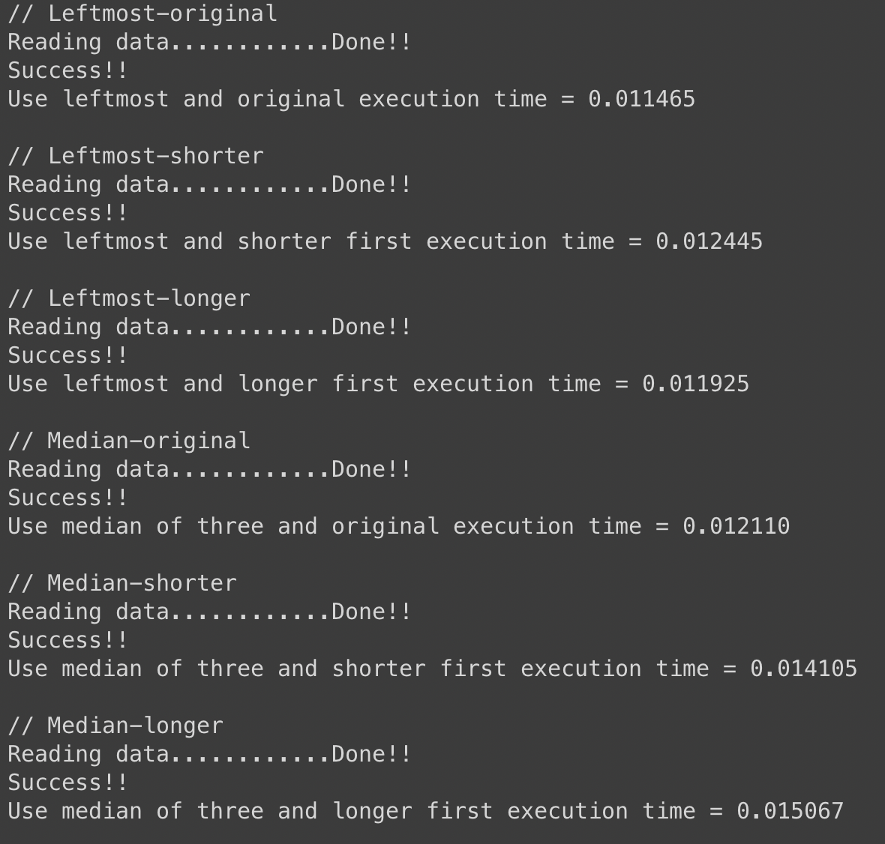
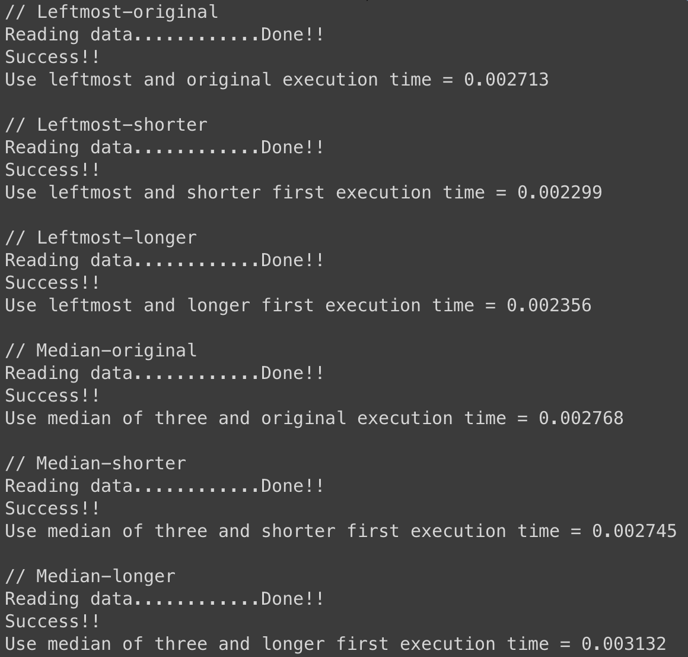

# 資料結構作業十

## 程式作業

### 測試結果 
*(單位為秒)*

#### data_150k.txt

#### data_50k.txt

### 結果分析

First of all, we compare "Leftmost" and "Median of three".
Theoretically, using "Median of three" would cause closer length of left and right parts. Which normally will reduce the time cost.

But the result I get from my code, it's quite different.
Guess:
1. My program is losing efficiency at some parts. (e.g. gemedian)
2. Data is already in the order which might cause worst case for median of three.

Second, we compare shorter, longer and original.
Theoretically, original based on the order of data, it's hard to control. Then, shorter first might be faster than longer first. When memory usage is less, the program runs faster. That is, if we done shorter ones first, when processing longer ones, the using memory isn't as much as opposite. So we can see that shorter first is faster than longer first.
